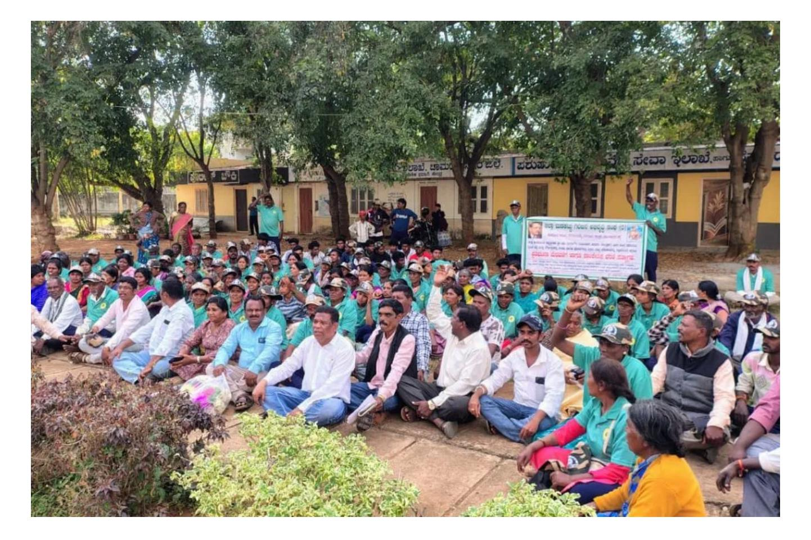
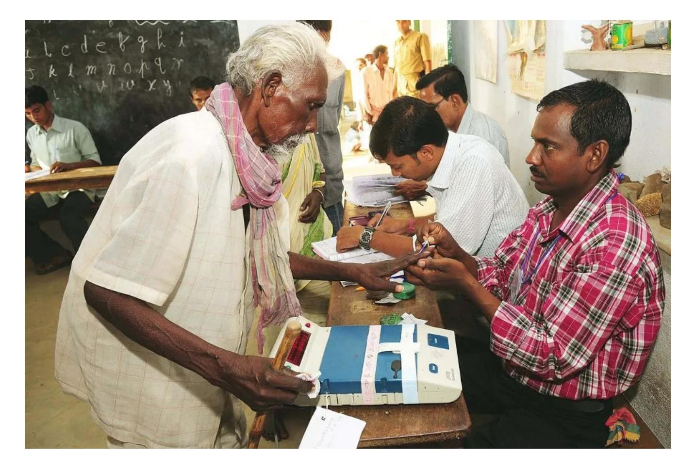

**[IDR Hindi](https://hindi.idronline.org/?utm_source=english_website&utm_medium=website) [Languages](https://idronline.org/article/perspectives/what-does-the-dpdp-act-mean-for-philanthropy-in-india/#) [▼](https://idronline.org/article/perspectives/what-does-the-dpdp-act-mean-for-philanthropy-in-india/#)**

[PERSPECTIVES](https://idronline.org/features/perspectives/) October 13, 2023

# **What does the DPDP Act mean for philanthropy in India?**

With the introduction of the Digital Personal Data Protection Act, it may be useful to revisit how we think about data collection and impact measurement.

by **[GAUTAM JOHN](https://idronline.org/contributor/gautam-john/)**

*6 min read*

The [Digital Personal Data Protection \(DPDP\) Act](https://www.meity.gov.in/writereaddata/files/Digital%20Personal%20Data%20Protection%20Act%202023.pdf) of 2023 marks a significant shift in India's legislative landscape. By establishing a comprehensive national framework for processing personal data, it replaces the previously limited data protection regime under the [Information Technology](https://www.indiacode.nic.in/bitstream/123456789/13116/1/it_act_2000_updated.pdf) [Act](https://www.indiacode.nic.in/bitstream/123456789/13116/1/it_act_2000_updated.pdf), 2000.

The DPDP Act applies to the processing of digital personal data within India, and to data collected outside India if one is offering goods or services to Indian residents. The act encapsulates various [principles of data protection,](https://www.dataprotection.ie/en/individuals/data-protection-basics/principles-data-protection) such as purpose limitation, data minimisation, storage limitation, and accountability. It also provides multiple [data subject](https://privacyinternational.org/sites/default/files/2018-09/Part%204%20-%20Rights%20of%20Data%20Subjects.pdf)[1](#page-6-0) rights (rights of individuals whose data is being collected), including access, data correction, deletion, and grievance redressal.

Beyond its legal ramifications, however, the passage of the DPDP Act calls for a moment of

introspection for the philanthropic community. The act's emphasis on data protection and privacy Want key insights from this article? Type your question here.

organisations and their grantees.

While the DPDP Act covers a broad spectrum of data concerns, this article focuses on exploring its implications on impact measurement within the philanthropic realm. As we delve into this facet, it's worth noting that the act, like any evolving legislation, will invite further interpretations.

# **CSR's focus on data-driven impact measurement**

India's [CSR regulations](https://www.csr.gov.in/content/csr/global/master/home/aboutcsr/csr-legislation.html) have historically pushed companies towards a data-driven approach to demonstrate their social and environmental impact, insisting on detailed tracking of both user data and impact measurement. This is regardless of the model adopted by CSRs, that is, whether they run their own social and environmental projects or allocate grants to nonprofits to execute initiatives on their behalf.

**The rigorous demand for data and impact evidence is now at odds with the stringent provisions of the DPDP Act.**

For instance, if a company undertakes an education initiative directly, it might require detailed student profiles to demonstrate the tangible outcomes of its interventions. In a similar vein, nonprofits being funded by companies are often asked to furnish comprehensive reports showcasing impact—this necessitates the collection of data such as medical histories, personal

stringent provisions of the DPDP Act, especially those pertaining to user data collection, storage, and reporting[.2](https://idronline.org/wp-admin/post.php?post=32253&action=edit#footnotes) Such a clash has significant implications for funders and civil society organisations that engage in impact measurement and evaluation, and raises important questions about user data collection and reporting and compliance.

# **What will change?**

Collecting personal details without informed consent was an ethical conundrum even before the introduction of the DPDP Act.[3](https://idronline.org/wp-admin/post.php?post=32253&action=edit#footnotes) The act merely crystallises these ethical concerns into tangible legal mandates. For example, under Sections 3 and 4 of the new legislation, gathering intimate personal information such as health records or financial data without explicit consent could pose legal risks.

Moreover, the act's emphasis on data security, minimisation, and explicit consent complicates the previously straightforward reporting processes integral to CSR. Complying with data security and minimisation requirements in Sections 8 and 11 may add substantial administrative burdens for resource-strapped organisations.

In addition, if nonprofits are to comply, they will be confronted with increased legal liabilities and administrative overheads. This cost is more than just financial; it takes away from resources that could be channelled into doing transformative work.

If nonprofits are to comply, they will be confronted with increased legal liabilities and administrative overheads. | Picture courtesy: [Freerange](https://freerangestock.com/photos/135531/lady-justice-%28justitia%29.html)

# **Going beyond numbers**

Given the stringent requirements of the DPDP Act, there's a pressing need for revisiting and potentially revising the CSR guidelines. Striking a balance between accountability and privacy becomes crucial in ensuring compliance with both CSR and data protection mandates.

While accountability remains paramount, it's time to [transition from rigid metrics](https://ssir.org/articles/entry/plotting_impact_beyond_simple_metrics) to narratives of change. By fostering relationships built on mutual respect and shared learning, practices followed by donor organisations can resonate with the ethos of the DPDP Act and nurture a more collaborative philanthropic ecosystem.

This necessitates a fundamental rethinking of how social impact can be measured, and shifting the

expectations, building capacity, and championing new trust-based and collaborative models of assessing progress.

While the philanthropic sector, especially CSR, has traditionally leaned heavily on quantitative metrics to measure impact, it's becoming increasingly evident that numbers alone don't capture the full spectrum of change. Trust-based philanthropy does not seek to abandon these metrics but to complement them. It suggests that, alongside traditional measurements, there's room for more qualitative, human-centric indicators.

Drawing from the experiences of pioneering funders and nonprofits, here are our learnings on implementing trust-based philanthropy in the context of the DPDP Act.

### **1. Have conversations with your grantees**

Funders have an obligation to understand impact, but the understanding becomes more profound when it's rooted in both data as well as human experiences. Strict numerical metrics sometimes miss the nuanced changes and adaptations taking place in communities.

Instead of solely focusing on end results, trust-based philanthropy encourages funders to appreciate the journey—the collaborative learning processes, the stories of resilience, and the community-led innovations that are responsible for those results. This doesn't mean throwing away the numbers, but instead adding layers of narratives and community feedback to them.

Rooted in values such as equity, community, and opportunity, trust-based philanthropy aims to build stronger relationships with grantees, cultivate mutual learning, centre trust with nonprofits, and redistribute power in the philanthropic sector.

Funders can start by initiating conversations with grantees about their experiences and stories on the ground. Impact assessment can become a richer, more holistic process by incorporating tools such as participatory storytelling and [feedback loops.](https://listen4good.org/feedback101/what-is-a-feedback-loop-gathering-feedback-from-nonprofit-clients/) The idea is to strive for a balance between quantitative outcomes and qualitative process learnings.

people and their stories, and supported by numbers, not dictated by them.

# **2. Streamline data demands**

By streamlining data demands, trust-based philanthropy liberates grantee partners from the complexities of data management and aligns seamlessly with the DPDP Act. The implications of excessive data collection extend beyond administrative burdens. Constant monitoring can feel invasive to communities and reduce their rich life experiences to mere data points. Such scrutiny can be emotionally taxing and may alienate the very individuals we aim to uplift.

Trust-based philanthropy inherently champions data minimisation and privacy—both of which the DPDP Act emphasises—by valuing qualitative insights over exhaustive quantitative data.

From an economic perspective, trust-based philanthropy offers undeniable benefits. By minimising costs related to data collection and compliance, funds can be redirected to more impactful initiatives, optimising the societal value of every rupee invested.

# **A compass for CSR and philanthropy**

Recent research provides mounting evidence that trust-based practices are taking hold in philanthropy. A 2023 [CEP study](http://cep.org/wp-content/uploads/2023/06/NVP_State-of-Nonprofits_2023.pdf) found that more than half of the nonprofit leaders surveyed reported increased trust from funders compared to the previous year. Many nonprofits also experienced shifts towards alignment with trust-based tenets, including 48 percent seeing reduced grant restrictions, 40 percent receiving more multi-year funding, and more than 50 percent facing streamlined applications and reporting. Nonprofit leaders specifically cited unrestricted and multiyear funding as the most helpful changes. This demonstrates the growing embrace of flexibility, responsiveness, and mutual understanding.

The DPDP Act should serve as a compass for CSRs and the philanthropic community. By moderating our data demands, we uphold the privacy and agency of the people we serve and alleviate the burdens on our grantee partners.

that's not just compliant with the law but also resonates with the communities

Source: [DPDP Act](https://www.meity.gov.in/writereaddata/files/Digital%20Personal%20Data%20Protection%20Act%202023.pdf)

*Disclaimer: IDR is funded by Rohini Nilekani Philanthropies.*

#### **Footnotes:**

—

1. The terminology used in the DPDP Act is 'data principal' for the person to whom the data relates and 'data fiduciary' for the processor of the data. This is intended to recast the provider as the primary owner and rights holder (as the principal) and implies fiduciary duties on the data processor (to ensure that processing remains in the interest of the data principal).

2. It should be noted that Section 7(d) of the DPDP Act allows for the processing of

(health records and financial data) was already a feature of the IT Rules. With the DPDP Act, there has been some easing of norms—while informed consent is the norm, Section 7 allows a data fiduciary to proceed with processing personal information that the user provides voluntarily and for a specific purpose. This is in the spirit of opting out rather than in. However, providing notice and opportunity to exercise rights (access, correction, and erasure) are required even in non-consensual processing, and so there will be administrative overheads to ensure compliance.

#### —

# **Know more**

- Read [this](https://carnegieindia.org/2023/10/03/understanding-india-s-new-data-protection-law-pub-90624) analysis to learn more about the development of data protection legislation in India.
- Read [this](https://idronline.org/article/technology/a-new-paradigm-for-nonprofit-programming/) article to learn more about the role of technology and real-time data in nonprofit programming.

Tags: **[Data,](https://idronline.org/tag/data/) [Data Collection](https://idronline.org/tag/data-collection/), [Laws In India,](https://idronline.org/tag/laws-in-india/) [Perspectives](https://idronline.org/tag/perspectives/), [Philanthropy](https://idronline.org/tag/philanthropy/)**

**We want IDR to be as much yours as it is ours. Tell us what you want to read.**

# **ABOUT THE AUTHORS**

#### **[GAUTAM JOHN](https://idronline.org/contributor/gautam-john/)**

Gautam John is the CEO of [Rohini Nilekani Philanthropies](http://nilekaniphilanthropies.org/). Prior to this, he spent several years with the Akshara Foundation building the Karnataka Learning Partnership and at Pratham Books building their open source publishing model. Gautam also advises a number of organisations, including Pratham Books, Akshara Foundation, and Children's Lovecastles Trust. He was a TED India Fellow in 2009. Before entering the nonprofit sector, he was an entrepreneur for six years. Gautam graduated from the National Law School of India University in 2002.

#### **COMMENTS**

#### LOAD COMMENTS

#### **READ NEXT**

[PERSPECTIVES](https://idronline.org/features/perspectives/)

### **[For us Adivasis, without forests there is no health](https://idronline.org/article/perspectives/for-us-adivasis-without-forests-there-is-no-health/)**

For Adivasi communities in Karnataka, health and subsistence are inseparable from forests and the history of displacement they carry. Healthcare, then, is not simply a matter of 'free' medicines or hospitals, but respecting our rights, knowledge, and dignity.

by **[C MADEGOWDA](https://idronline.org/contributor/c-madegowda)** | 7 min read

#### [PERSPECTIVES](https://idronline.org/features/perspectives/)

# **[Confessions of a professional panellist](https://idronline.org/article/perspectives/confessions-of-a-professional-panellist/)**

Panels at conferences are meant to generate insights, discourse, and solutions. But are they accomplishing this?

by **[HISHAM MUNDOL](https://idronline.org/contributor/hisham-mundol)** | 3 min read

[PERSPECTIVES](https://idronline.org/features/perspectives/)

# **[From the village to the Republic](https://idronline.org/article/perspectives/from-the-village-to-the-republic/)**

The idea of local self-governance has been a key part of India's political imagination. However, development has often meant centralisation, undermining communities' rights over jal, jangal, and zameen.

by **[RAMESH SHARMA](https://idronline.org/contributor/ramesh-sharma)** | 6 min read

**ABOUT SECTORS**

[Team](https://idronline.org/about/#team) [Agriculture](https://idronline.org/sectors/agriculture/)

[Board](https://idronline.org/about/#board) [Education](https://idronline.org/sectors/education/)

[Funding Partners](https://idronline.org/about/#funding_partners) [Environment](https://idronline.org/sectors/environment/)

[Ethics Statement](https://idronline.org/about/#ethics_statement) [Health](https://idronline.org/sectors/health/)

[Rights](https://idronline.org/sectors/rights/)

[Livelihoods](https://idronline.org/sectors/livelihoods/)

[Water & Sanitation](https://idronline.org/sectors/water-sanitation/)

**EXPERTISE THEMES**

[Board & Governance](https://idronline.org/expertise/board-governance/) [Advocacy & Government](https://idronline.org/themes/advocacy-government/)

[Fundraising & Communications](https://idronline.org/expertise/fundraising-and-communications/) [Diversity & Inclusion](https://idronline.org/themes/diversity-inclusion/)

[Leadership & Talent](https://idronline.org/expertise/leadership-talent/) [Gender](https://idronline.org/themes/gender/)

[Monitoring & Evaluation](https://idronline.org/expertise/monitoring-evaluation/) [Philanthropy & CSR](https://idronline.org/themes/philanthropy-csr/)

[Programme](https://idronline.org/expertise/programme/) [Social Business](https://idronline.org/themes/social-business/)

[Technology](https://idronline.org/expertise/technology/) [Urban](https://idronline.org/themes/urban/)

[Climate Emergency](https://idronline.org/themes/climate-emergency/)

[COVID-19](https://idronline.org/themes/covid-19/)

[Collaboration](https://idronline.org/themes/collaboration/)

[Ecosystem Development](https://idronline.org/themes/ecosystem-development/)

[Inequality](https://idronline.org/themes/inequality/)

[Scale](https://idronline.org/themes/scale/)

[Social Justice](https://idronline.org/themes/social-justice/)

[Youth](https://idronline.org/themes/youth/)

**FOLLOW US**

If you like what you're reading and find value in our articles, please support IDR by making a donation.

#### **[DONATE NOW](https://idronline.org/donate/)**

| Get smart. Sign up for our free weekly newsletter, IDR Edit. |  |  |  |
|--------------------------------------------------------------|--|--|--|
|--------------------------------------------------------------|--|--|--|

Your email address

SIGN UP

IDR is Asia's largest knowledge platform for ideas and insights on philanthropy and social impact.

We publish cutting-edge perspectives and lessons, written by and for the people working on some of India's toughest problems. Our job is to make things simple and relevant, so you can do more of what you do, better.

[Privacy Policy](https://idronline.org/privacy-policy/) | [Terms of Use](https://idronline.org/terms-of-use/) | [Contact](https://idronline.org/contact/)

#### ©2026 India Development Review

India Development Review is published by the Forum for Knowledge and Social Impact, a not-for-profit company registered under Section 8 of the Company Act, 2013.

CIN: U93090MH2017NPL296634

